

<a href="https://cacg-code.github.io/">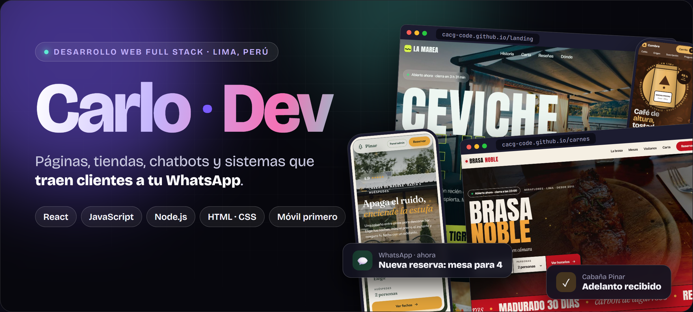</a>

 

<a href="https://cacg-code.github.io/"></a>

  

<a href="https://www.linkedin.com/in/carlo-andre-chiuyare-guillen-916944224">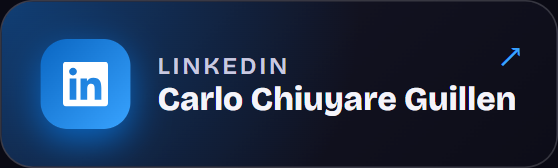</a>
<a href="https://github.com/Cacg-code">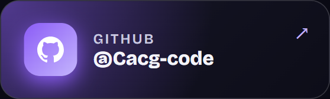</a>
<a href="https://wa.me/51991053535?text=Hola%20Carlo%2C%20vi%20tu%20portafolio%20y%20quiero%20una%20p%C3%A1gina%20web.">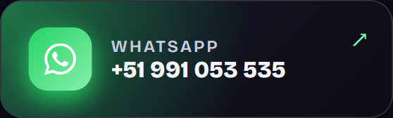</a>
<a href="mailto:chiuyareguillendev@gmail.com">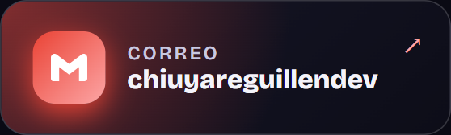</a>

  


  

<a href="#quién-soy">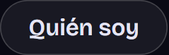</a> <a href="#demos">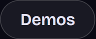</a> <a href="#servicios">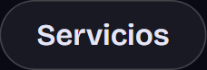</a> <a href="#cómo-trabajo">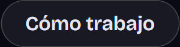</a> <a href="#contacto">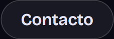</a>

 

<h2 align="center">Quién soy</h2>

**Carlo Andre Chiuyare Guillen** · desarrollador Full Stack · Lima, Perú

- 💼 **Practicante Full Stack Developer en BellUX Innovation** (remoto): trabajo en productos propios de la empresa.
- 🎓 **Estudiante de Ingeniería de Sistemas**, 10.º ciclo.
- 🛠️ Hago **páginas web, tiendas online, chatbots y sistemas a medida** para negocios locales: que se vean bien, carguen rápido y **te traigan clientes por WhatsApp**.
- 📱 Todo se diseña **primero para celular**, porque ahí te buscan tus clientes.

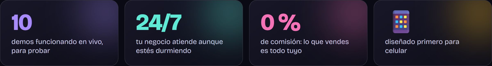

 

<h2 align="center">Demos</h2>

<i>Cada una es una página real, hecha desde cero para un negocio inventado. Toca una para abrirla.</i>

<table>
<tr>
<td width="50%"><a href="https://cacg-code.github.io/carnes/">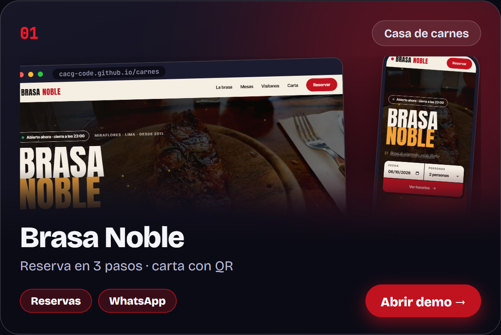</a></td>
<td width="50%"><a href="https://cacg-code.github.io/landing/">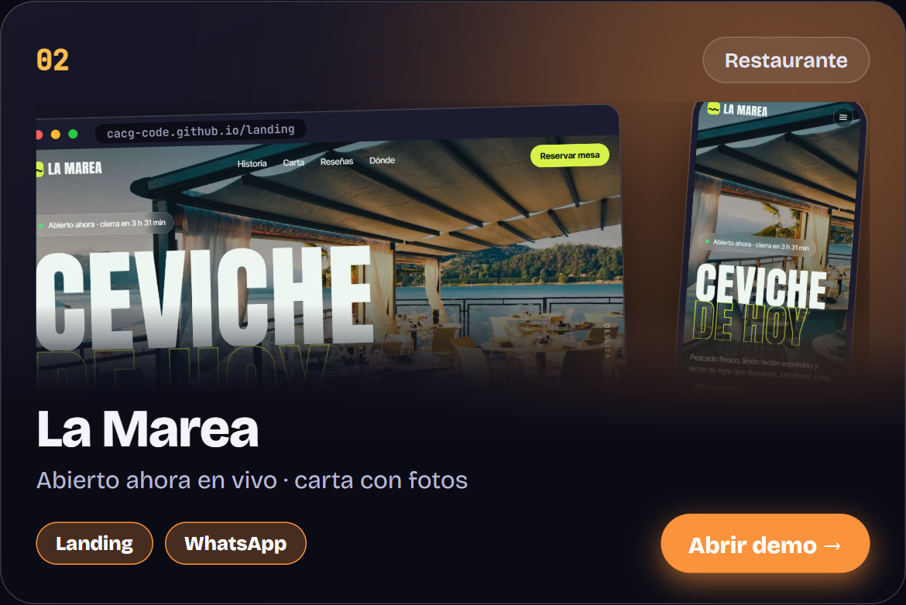</a></td>
</tr>
<tr>
<td width="50%"><a href="https://cacg-code.github.io/tienda/">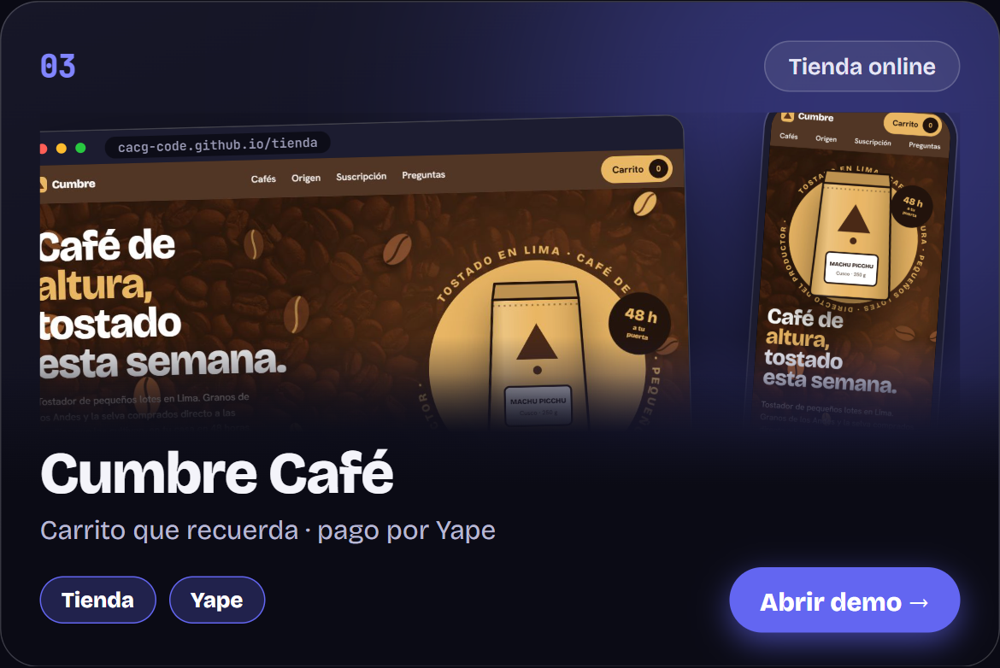</a></td>
<td width="50%"><a href="https://cacg-code.github.io/cabana/">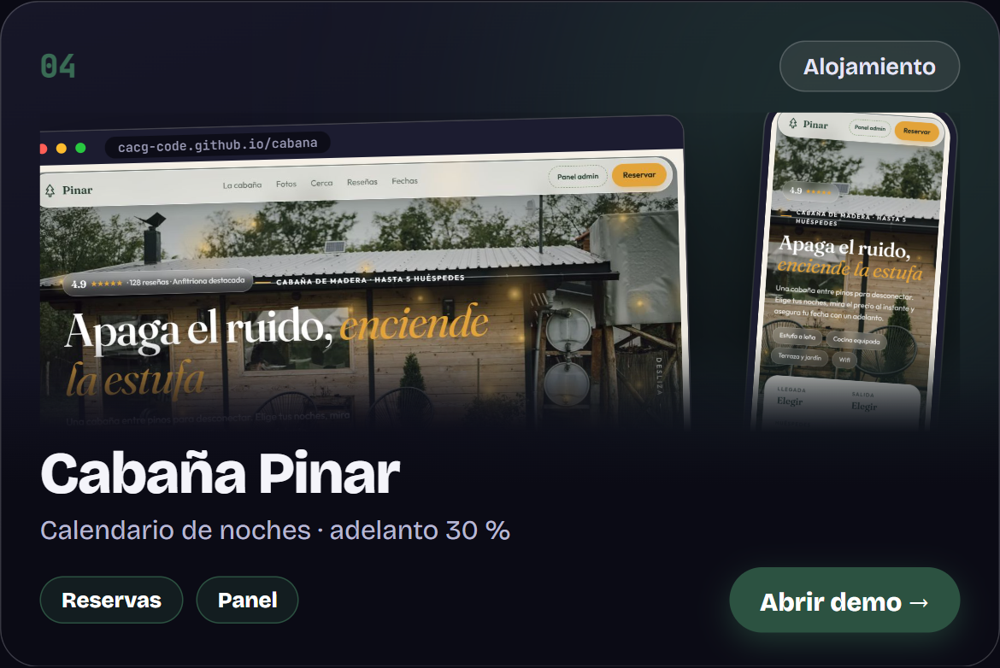</a></td>
</tr>
<tr>
<td width="50%"><a href="https://cacg-code.github.io/crm/">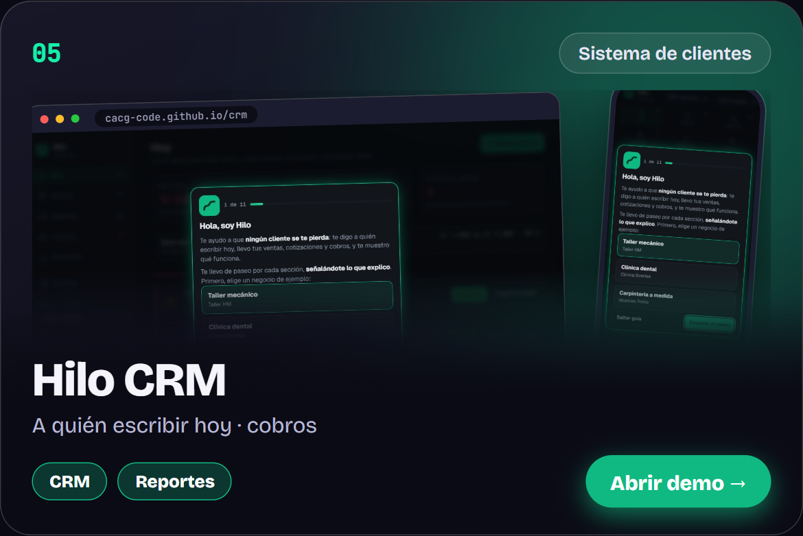</a></td>
<td width="50%"><a href="https://cacg-code.github.io/ferremax/">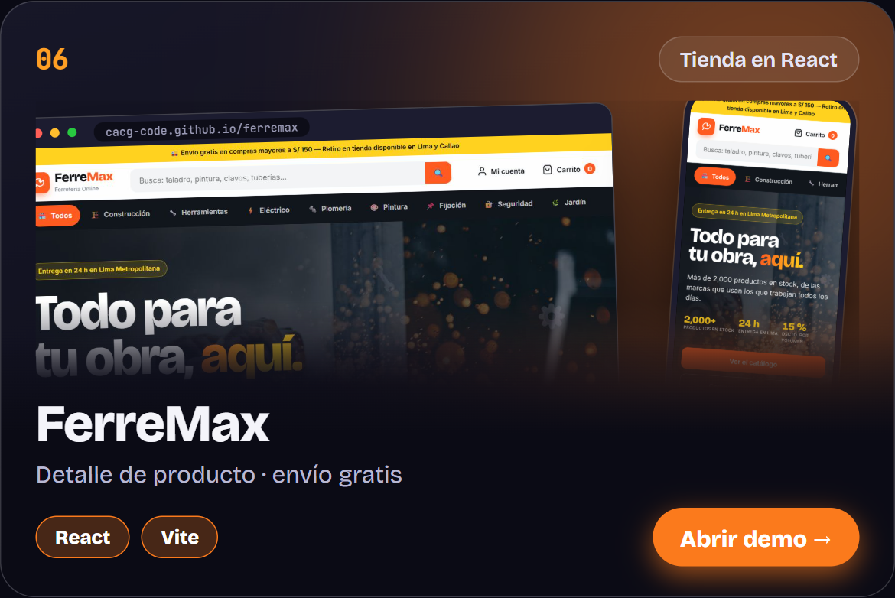</a></td>
</tr>
<tr>
<td width="50%"><a href="https://cacg-code.github.io/spa/">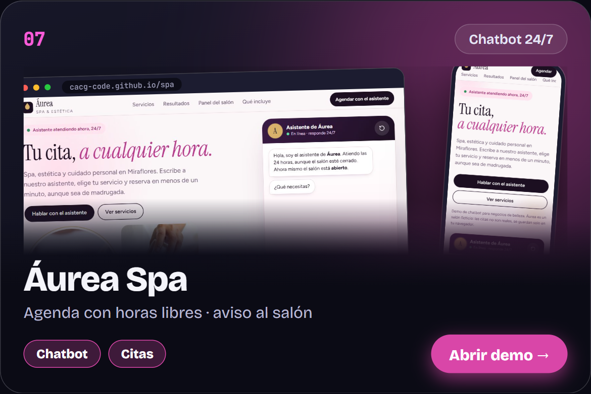</a></td>
<td width="50%"><a href="https://cacg-code.github.io/evento/">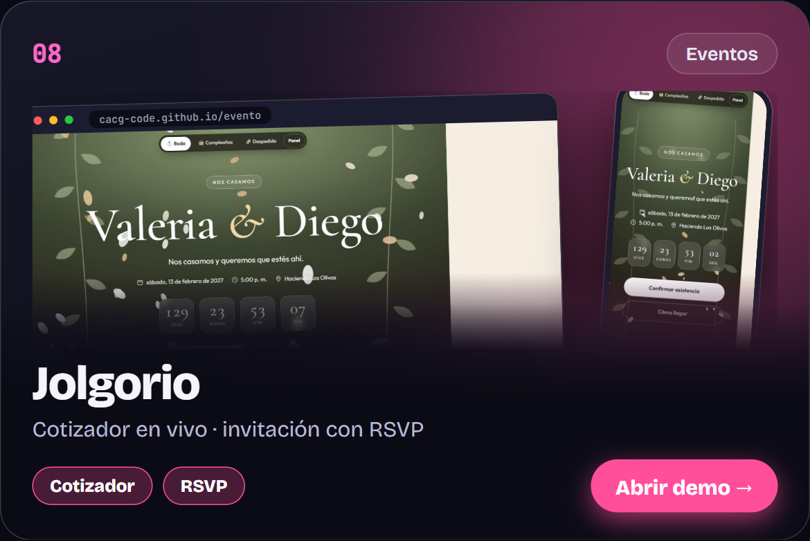</a></td>
</tr>
<tr>
<td width="50%"><a href="https://cacg-code.github.io/academia/">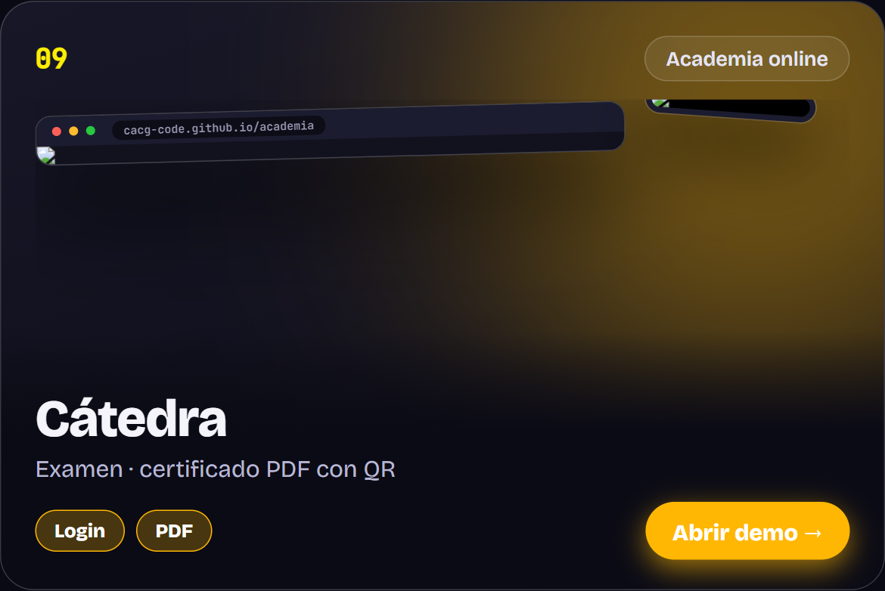</a></td>
<td width="50%"><a href="https://cacg-code.github.io/estudio/">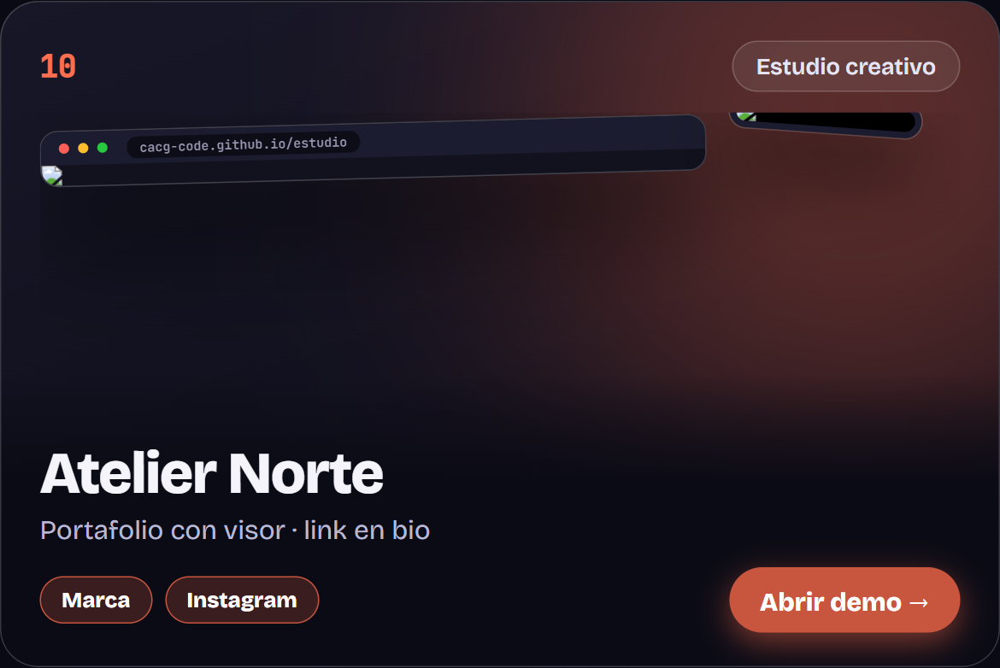</a></td>
</tr>
</table>

 

<h2 align="center">Servicios</h2>

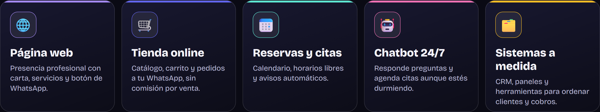

 

<h2 align="center">Cómo trabajo</h2>

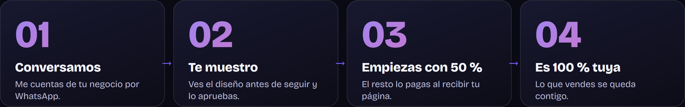

 

<h2 align="center">Contacto</h2>

<a href="https://wa.me/51991053535?text=Hola%20Carlo%2C%20vi%20tu%20portafolio%20y%20quiero%20una%20p%C3%A1gina%20web.">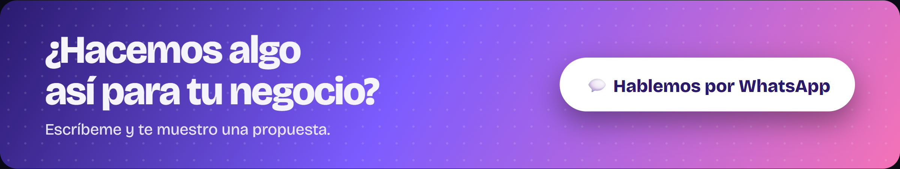</a>

 

---

**© 2026 Carlo Andre Chiuyare Guillen. Todos los derechos reservados.** 
El código, el diseño, los textos y las imágenes de este repositorio **no pueden copiarse, descargarse para reutilizarse, modificarse ni redistribuirse** sin autorización escrita del autor. Ver [LICENSE](LICENSE). 
Desarrollo con apoyo de IA (Claude), bajo dirección y revisión del autor. Los negocios, teléfonos y datos de las demos son ficticios. Fotos: Unsplash.

