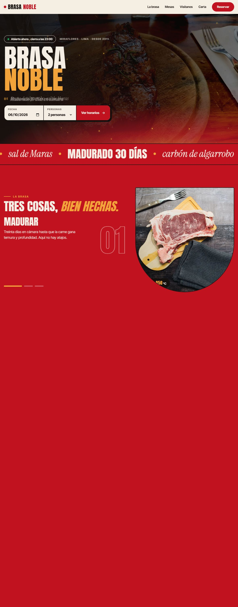
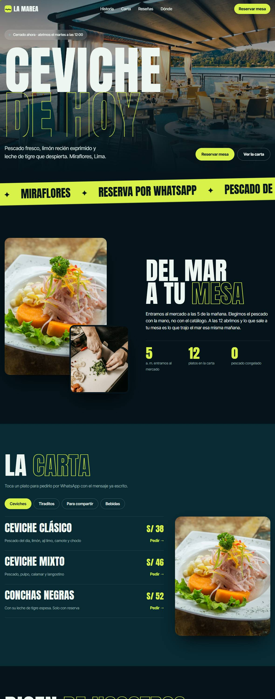
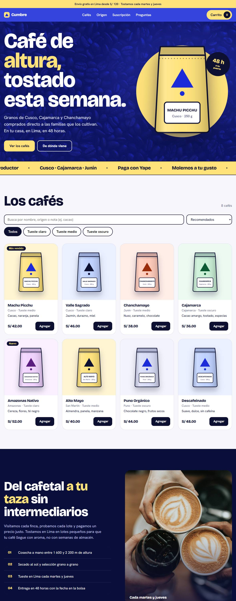
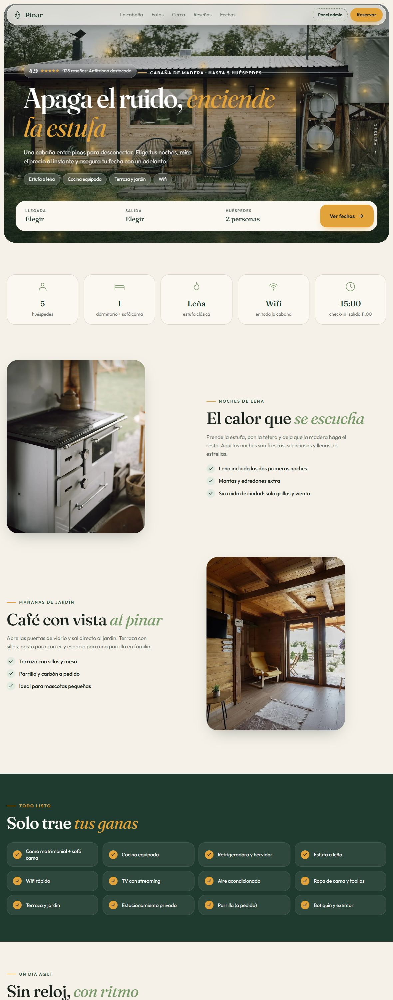
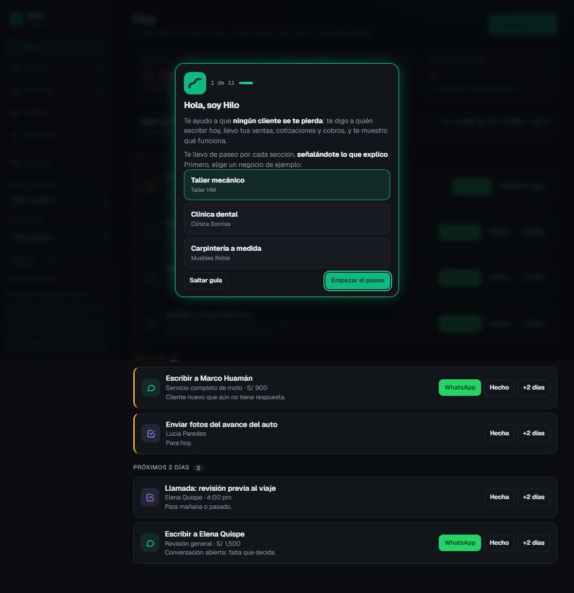
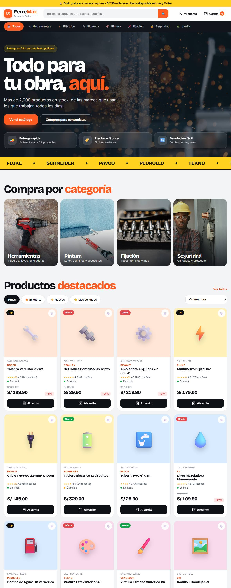
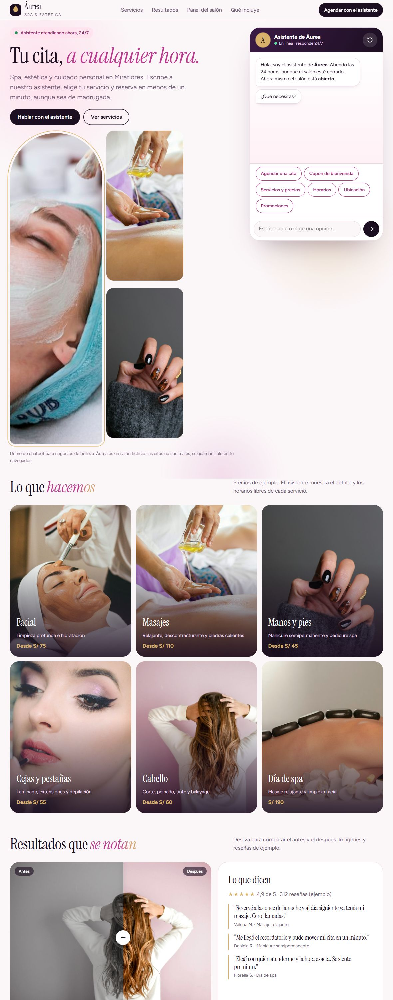
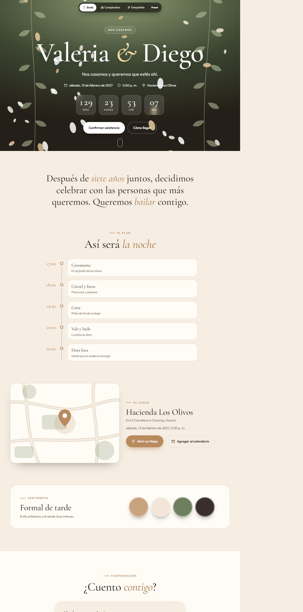

<div align="center">

<a href="https://cacg-code.github.io/">
  
</a>

<br>

<a href="https://cacg-code.github.io/">
  
</a>

<br><br>

[](https://www.linkedin.com/in/carlo-andre-chiuyare-guillen-916944224)
[](https://github.com/Cacg-code)
[](https://wa.me/51991053535?text=Hola%20Carlo%2C%20vi%20tu%20portafolio%20y%20quiero%20una%20p%C3%A1gina%20web.)
[](mailto:chiuyareguillendev@gmail.com)


**👉 [cacg-code.github.io](https://cacg-code.github.io/) 👈**

*10 demos que puedes abrir, tocar y probar. Sin registrarte.*

</div>

<p align="center">
  <a href="#-quién-soy"><b>Quién soy</b></a> ·
  <a href="#-las-10-demos"><b>Demos</b></a> ·
  <a href="#-qué-puedo-hacer-por-tu-negocio"><b>Servicios</b></a> ·
  <a href="#-cómo-trabajo"><b>Cómo trabajo</b></a> ·
  <a href="#-hablemos"><b>Contacto</b></a>
</p>

---

## 👋 Quién soy

Soy **Carlo Andre Chiuyare Guillen**, desarrollador **Full Stack** de Lima, Perú.

- 💼 **Practicante Full Stack Developer en [BellUX Innovation](https://www.linkedin.com/in/carlo-andre-chiuyare-guillen-916944224)** (remoto), donde trabajo en productos propios de la empresa.
- 🎓 **Estudiante de Ingeniería de Sistemas**, 10.º ciclo.
- 🛠️ Creo **páginas web, tiendas online, chatbots y sistemas a medida** para negocios locales: que se vean bien, carguen rápido y *te traigan clientes por WhatsApp*.
- 📱 Todo se diseña **primero para celular**, porque ahí te buscan tus clientes.

> Este repositorio es el código de mi portafolio. Cada carpeta es una demo funcional de un negocio inventado, para que veas cómo quedaría el tuyo.

## 🎬 Las 10 demos

Cada demo es una página real, hecha desde cero. Ábrelas desde tu celular o computadora.

| | Demo | Qué resuelve |
|---|---|---|
|  | **[Brasa Noble](https://cacg-code.github.io/carnes/)**<br>Casa de carnes | Reserva en 3 pasos, aviso por WhatsApp y carta con QR. |
|  | **[La Marea](https://cacg-code.github.io/landing/)**<br>Restaurante | Dice si está abierto ahora, carta con fotos y reservas por WhatsApp. |
|  | **[Cumbre Café](https://cacg-code.github.io/tienda/)**<br>Tienda online | Filtros, carrito que recuerda y pedido directo a WhatsApp con Yape. |
|  | **[Cabaña Pinar](https://cacg-code.github.io/cabana/)**<br>Alojamiento | Calendario de noches, adelanto por Yape/Plin y panel de la anfitriona. |
|  | **[Hilo CRM](https://cacg-code.github.io/crm/)**<br>Sistema de clientes | Te dice a quién escribir hoy; ventas, cotizaciones y cobros. |
|  | **[FerreMax](https://cacg-code.github.io/ferremax/)**<br>Tienda en React | Categorías, detalle de producto y carrito con envío gratis. |
|  | **[Áurea Spa](https://cacg-code.github.io/spa/)**<br>Chatbot 24/7 | Agenda citas con horas libres y avisa al salón por WhatsApp. |
|  | **[Jolgorio](https://cacg-code.github.io/evento/)**<br>Eventos | Cotizador en vivo, reserva con adelanto e invitación con RSVP. |
| 🎓 | **[Cátedra](https://cacg-code.github.io/academia/)**<br>Academia online | Login por matrícula, examen, certificado PDF con QR y panel de avance. |
| 📸 | **[Atelier Norte](https://cacg-code.github.io/estudio/)**<br>Estudio creativo | Portafolio con visor, paquetes por WhatsApp y link en bio. |

## 💡 Qué puedo hacer por tu negocio

| | |
|---|---|
| 🌐 **Página web** | Presencia profesional con tu carta, servicios y botón de WhatsApp. |
| 🛒 **Tienda online** | Catálogo, carrito y pedidos directos a tu WhatsApp, sin comisiones por venta. |
| 📅 **Reservas y citas** | Calendario, horarios libres y avisos automáticos. |
| 🤖 **Chatbot** | Atiende preguntas frecuentes y agenda citas las 24 horas. |
| 🗂️ **Sistemas a medida** | CRM, paneles y herramientas para ordenar clientes y cobros. |

## 🤝 Cómo trabajo

1. **Conversamos** por WhatsApp sobre tu negocio y lo que necesitas.
2. **Te muestro** un diseño antes de seguir, para que lo apruebes.
3. **Empiezas con el 50 %** y pagas el resto al recibir tu página. Sin sorpresas.
4. **Tu página es 100 % tuya**: lo que vendes se queda contigo, sin porcentajes.

## 🧱 Cómo está hecho

Sitio estático, **un archivo por página**, sin build ni dependencias: HTML, CSS y JavaScript puro. Las demos se publican con GitHub Pages desde `main`. FerreMax es la excepción: es una app **React + Vite** (aquí va la versión compilada).

```
/            Portafolio principal
/carnes      Brasa Noble        /landing   La Marea
/tienda      Cumbre Café        /cabana    Cabaña Pinar
/crm         Hilo CRM           /ferremax  FerreMax (React)
/spa         Áurea Spa          /evento    Jolgorio
/academia    Cátedra            /estudio   Atelier Norte
```

Para probarlo en tu PC: clona el repo y sirve la carpeta (`python -m http.server 8000`), luego abre `http://localhost:8000`.

## 📬 Hablemos

¿Quieres una página como alguna de estas para tu negocio?

<div align="center">

[](https://wa.me/51991053535?text=Hola%20Carlo%2C%20vi%20tu%20portafolio%20y%20quiero%20una%20p%C3%A1gina%20web.)
[](https://www.linkedin.com/in/carlo-andre-chiuyare-guillen-916944224)

</div>

---

<sub>**© 2026 Carlo Andre Chiuyare Guillen. Todos los derechos reservados.** Ver [LICENSE](LICENSE). Desarrollo con apoyo de IA (Claude), bajo dirección y revisión del autor. Los negocios, teléfonos y datos de las demos son ficticios. Fotos: Unsplash.</sub>
